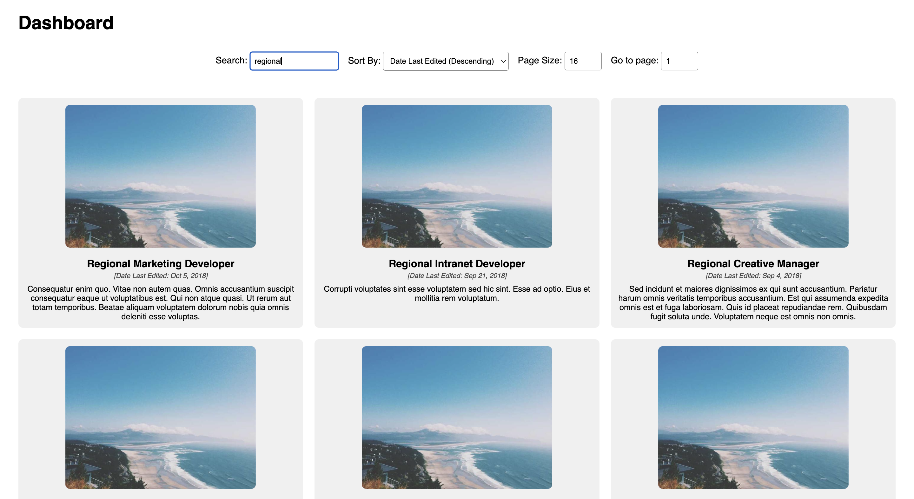
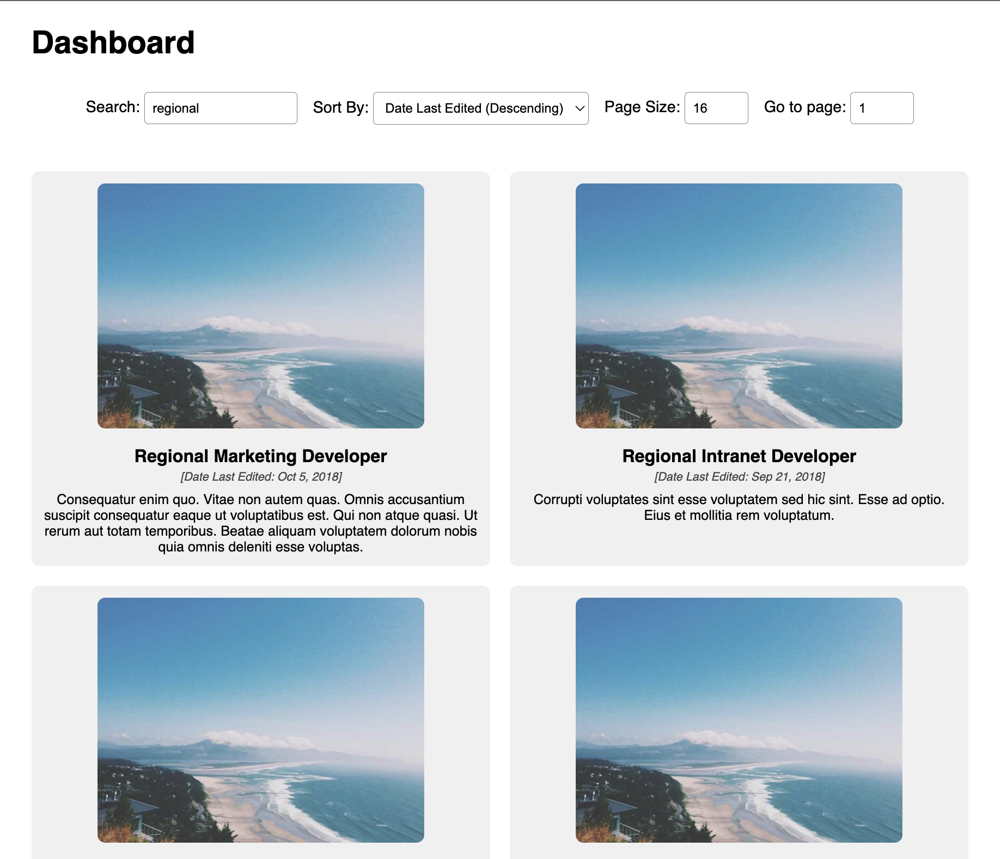
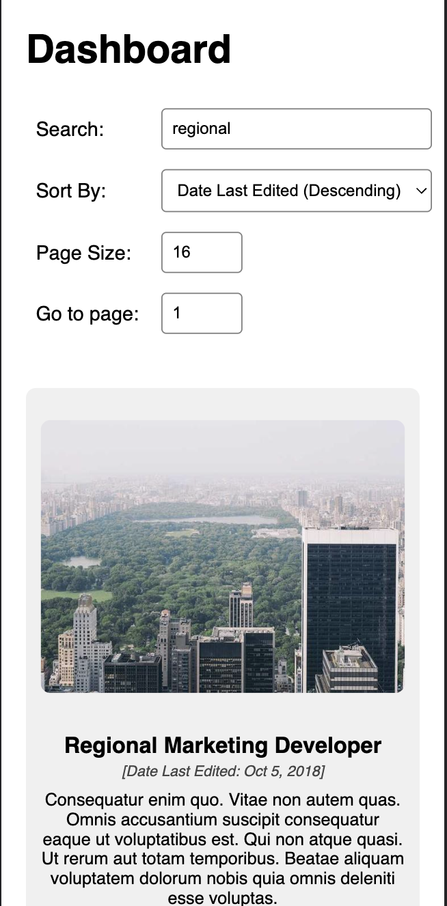

# Table Utils

## About the Project

Table utils is an Angular web application designed to provide users with a powerful and intuitive dashboard interface for efficiently managing and analyzing data. The project incorporates various essential features such as searching, sorting, and pagination, enabling users to interact with large datasets seamlessly. The UI state is controlled by the URL, allowing easy sharing of specific data configurations. The application is also responsive, making it accessible on a wide range of devices.

## UI Snapshots

Desktop View

Tablet View

Mobile View

## Features

- Search for exact and flexible string matches
- Sort fields in ascending/descending order
- Pagination using page numbers
- URL driven state management
- Responsive Design

## Try it out

You can access the live version of the application by visiting https://table-utils.netlify.app

## Setup

- Clone the github repository in your local machine using `git clone https://github.com/yksolanki9/ng-list-utils`
- Open the terminal and navigate to the project directory using `cd ng-list utils`
- Install the required dependencies using `npm i`
- Start the development server by running `npm start`
- Open your web browser and visit `localhost:4200` to access the project. The application will automatically reload if you change any of the source files.
- Run `ng test` to execute the unit tests via [Karma](https://karma-runner.github.io).

## Dataset

- The sample data used in this application is stored in `src/assets/data/data.json` file.
- Feel free to modify the data in the file to test the application with different datasets.
- Alternatively, you can change the value of `DATA_URL` variable in `src/app/core/services/data.service.ts` to fetch data from a different source.

## Contact

Please feel free to reach out to me at `yashsolanki1709@gmail.com` in case you have any queries.
